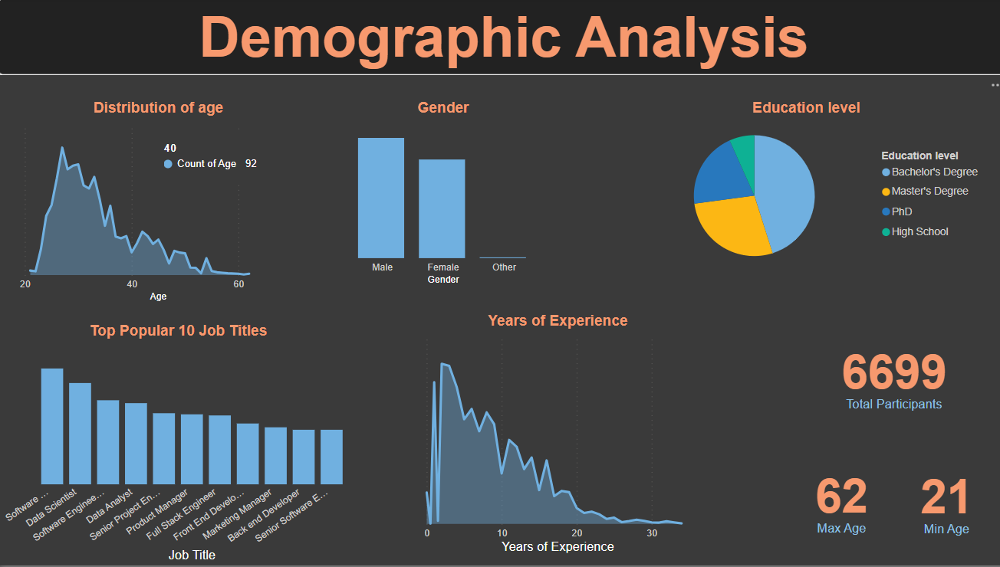

# 📊 Salary Prediction Analysis - Power BI Dashboard

## 🔍 Project Overview
A comprehensive analysis of salary trends using Power BI, examining:
- Gender pay disparities
- Education level impact on earnings
- Experience-to-salary relationships
- Predictive modeling insights

**Final Report:** [Salary Analysis - Final Report](Salary Analysis - Final Report.pdf)

## 🎯 Key Insights (from Power BI Analysis)
### 🧑‍🎓 Education Impact
- PhD holders earn **27% more** than Bachelor's degree holders
- High school graduates average **$43k** vs **$89k** for degree holders

### ♀ Gender Disparity
- **$13k average gap** favoring men
- Most extreme gap in Director roles (**$20k+** difference)

### 📈 Experience Correlation
- Strong linear relationship (R² = 0.82)
- Each year of experience ≈ **$2.4k salary increase**

### 🔮 Prediction Model
- Linear regression achieved **70% accuracy**
- Most predictive features:
  1. Years of experience
  2. Education level
  3. Job title

## 🛠️ Technical Implementation
**Tools Used:**
- Microsoft Power BI (Data modeling, DAX, visualizations)
- Power Query (Data cleaning)

**Dataset:**
- 6,699 records from Kaggle
- Fields: Age, Gender, Education, Job Title, Experience, Salary
- [Dataset Link] (https://www.kaggle.com/datasets/thedevastator/jobs-dataset-from-glassdoor)

## 📂 Dashboard Components
1. **Demographic Overview**
   - Age distribution (24-34 dominant)
   - Education breakdown (50% Bachelor's degrees)

2. **Salary Analysis**
   - Gender comparison matrix
   - Education level earnings
   - Experience correlation

3. **Predictive Modeling**
   - Actual vs predicted salary scatterplot
   - Feature importance visualization

## 🖥️ How to Use
1. Download the `.pbix` file from this repository
2. Open in Power BI Desktop
3. Refresh data connection if needed
4. Interact with filters:
   - Job title slicer
   - Education level toggle
   - Experience range slider

## 📌 Sample Visualization

## 💡 Business Applications
- HR compensation benchmarking
- Diversity & inclusion analytics
- Career path ROI calculations

## 📜 License
Educational use only - [Kaggle Dataset License](https://www.kaggle.com/datasets)

